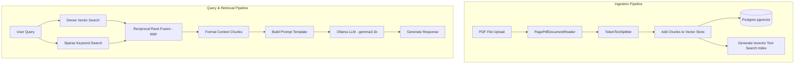

# Standard RAG Application

A robust, enterprise-ready **Retrieval-Augmented Generation (RAG)** backend service built with **Spring Boot 3 / 4**, **Spring AI**, **PostgreSQL with pgvector**, and **Ollama**. 

This application offers secure multi-tenant PDF document ingestion, document versioning, hybrid dense-sparse search, and localized question-answering using local LLM models.

---

## 🚀 Key Features

*   **Secure Authentication & Multi-Tenancy**: Built-in Spring Security framework utilizing JWT (JSON Web Tokens) to secure API endpoints, separating document access by user ID.
*   **Structured PDF Ingestion**: Automatic parsing of PDF files using `PagePdfDocumentReader` and chunking using Spring AI's `TokenTextSplitter`.
*   **Version Control**: Ability to update uploaded documents. Older document versions are soft-deleted from active retrieval while the latest version chunks are automatically indexed.
*   **Advanced Hybrid Search**:
    *   **Dense Semantic Search**: Leveraging `pgvector` vector store with local embedding models (e.g., `nomic-embed-text`).
    *   **Sparse Keyword Search**: Leveraging native PostgreSQL Full-Text Search (FTS) with a `tsvector` column and GIN index.
    *   **Rank Fusion**: Combines dense and sparse results using **Reciprocal Rank Fusion (RRF)** to optimize relevance.
*   **Local LLM Integration**: Prompts a local LLM (e.g., `gemma3:1b`) using Ollama to answer user questions based strictly on the retrieved context, with built-in anti-hallucination safeguards.

---

## 📐 Architecture & Data Flow



---

## 🛠️ Prerequisites

Ensure you have the following installed on your system:
1.  **Java Development Kit (JDK 21)**
2.  **Maven** (or use the included wrapper `./mvnw`)
3.  **Docker & Docker Compose** (for running PostgreSQL and Ollama)
4.  **Ollama** (alternatively run it natively or inside docker)

---

## 📦 Run & Startup Guide

### Option 1: Full Setup using Docker Compose (Recommended)

To run the database, Ollama, and the Spring Boot application together in docker:

1.  **Clone / open the project directory** and run:
    ```bash
    docker compose up -d
    ```
    This will start:
    *   **PostgreSQL with pgvector** on port `5433` (accessible on host).
    *   **Ollama** on port `11434`.
    *   **Spring Boot App** on port `8080`.

2.  **Download the LLM Models** in the Ollama container:
    ```bash
    # Pull the embedding model
    docker exec -it standard-rag-ollama ollama pull nomic-embed-text:latest
    
    # Pull the chat model
    docker exec -it standard-rag-ollama ollama pull gemma3:1b
    ```

3.  The application is now accessible at `http://localhost:8080`.

---

### Option 2: Run Locally (Hybrid Setup)

If you prefer to run the Spring Boot application locally on your host machine while keeping the services in Docker:

#### Step 1: Start the Database (PostgreSQL with pgvector)
Run only the database container from the compose file:
```bash
docker compose up -d db
```
This starts PostgreSQL on port `5433` with user `user`, password `chatbot`, and database `ChatBot-db`.

#### Step 2: Install and Run Ollama
1. Download Ollama from the [official website](https://ollama.com/) and run it.
2. Pull the required models:
   ```bash
   ollama pull gemma3:1b
   ollama pull nomic-embed-text:latest
   ```

#### Step 3: Run the Spring Boot App
Compile and start the application locally:
```bash
# Windows
mvnw.cmd spring-boot:run

# macOS/Linux
./mvnw spring-boot:run
```
The application will connect to the PostgreSQL instance at `localhost:5433` and Ollama at `localhost:11434`.

---

## ⚙️ Configuration Reference (`application.yaml`)

Key configurations can be customized in `src/main/resources/application.yaml` or overridden using environment variables:

```yaml
spring:
  ai:
    ollama:
      base-url: http://localhost:11434
      chat:
        options:
          model: gemma3:1b
      embedding:
        options:
          model: nomic-embed-text:latest
  datasource:
    url: jdbc:postgresql://localhost:5433/ChatBot-db
    username: user
    password: chatbot
```

| Property | Environment Variable | Default Value | Description |
| :--- | :--- | :--- | :--- |
| `spring.ai.ollama.base-url` | `SPRING_AI_OLLAMA_BASE_URL` | `http://localhost:11434` | Ollama connection endpoint |
| `spring.ai.ollama.chat.options.model` | `SPRING_AI_OLLAMA_CHAT_MODEL` | `gemma3:1b` | Local LLM for text generation |
| `spring.ai.ollama.embedding.options.model` | `SPRING_AI_OLLAMA_EMBEDDING_MODEL` | `nomic-embed-text:latest` | Local Model for embedding generation |
| `spring.datasource.url` | `SPRING_DATASOURCE_URL` | `jdbc:postgresql://localhost:5433/ChatBot-db` | Database connection URL |
| `jwt.secret-key` | `JWT_SECRET_KEY` | *(512-bit secret)* | Secret key to sign JWT tokens |

---

## 📡 API Endpoint Documentation

All endpoints (except auth) require a Bearer token in the `Authorization` header: `Authorization: Bearer <your_jwt_token>`.

### 1. Authentication Endpoints

#### Signup
*   **URL**: `/api/auth/signup`
*   **Method**: `POST`
*   **Request Body**:
    ```json
    {
      "username": "jane_doe",
      "name": "Jane Doe",
      "password": "securepassword123"
    }
    ```
*   **Response**:
    ```json
    {
      "id": 1,
      "username": "jane_doe",
      "name": "Jane Doe"
    }
    ```

#### Login
*   **URL**: `/api/auth/login`
*   **Method**: `POST`
*   **Request Body**:
    ```json
    {
      "username": "jane_doe",
      "password": "securepassword123"
    }
    ```
*   **Response**: Returns the JWT token as a raw string.

---

### 2. Document Management Endpoints

#### Upload PDF Document
*   **URL**: `/upload`
*   **Method**: `POST`
*   **Headers**: `Authorization: Bearer <token>`
*   **Request Parameter**: `file` (Multipart file, PDF format)
*   **Response**:
    ```json
    {
      "documentId": "DOC-xY7z9PqR",
      "filename": "sample_document.pdf",
      "message": "Upload Successful"
    }
    ```

#### Update PDF Document
*   **URL**: `/upload/{documentId}`
*   **Method**: `PUT`
*   **Headers**: `Authorization: Bearer <token>`
*   **Request Parameter**: `file` (Multipart file, PDF format)
*   **Response**:
    ```json
    {
      "documentId": "DOC-xY7z9PqR",
      "filename": "updated_document.pdf",
      "message": "Update Successful"
    }
    ```
    *Note: Incrementally updates version numbers. Previous chunks are set as inactive and eventually deleted.*

---

### 3. Chat / Query Endpoints

#### Query a Document (RAG)
*   **URL**: `/Documents/chat`
*   **Method**: `POST` or `GET`
*   **Headers**: `Authorization: Bearer <token>`
*   **Request Body**:
    ```json
    {
      "query": "What is the primary conclusion of the study?",
      "documentId": "DOC-xY7z9PqR"
    }
    ```
*   **Response**:
    ```json
    {
      "answer": "The primary conclusion of the study is that...",
      "documentId": "DOC-xY7z9PqR"
    }
    ```

---

## 🛠️ Development & Database Verification

If you want to manually verify the pgvector table and FTS index inside Postgres, connect to your database client and inspect:

1.  **Standard Table for metadata**: `documents`
2.  **Vector Store Table (Spring AI default)**: `vector_store`
3.  **GIN Index**: `vector_store_searchable_text_idx`

To check vector store entries:
```sql
SELECT id, content, metadata, embedding FROM vector_store LIMIT 5;
```

To run a manual keyword ranking test:
```sql
SELECT content, ts_rank_cd(searchable_text, plainto_tsquery('english', 'search terms')) AS score 
FROM vector_store 
WHERE searchable_text @@ plainto_tsquery('english', 'search terms') 
ORDER BY score DESC;
```
