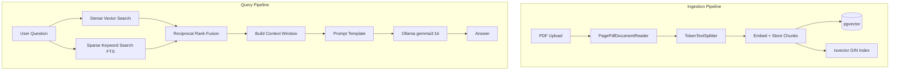

# 🧠 Standard RAG — Local AI Document Assistant


> A production-grade **Retrieval-Augmented Generation (RAG)** backend that lets users upload PDFs and query them using a **fully local LLM** — no OpenAI, no external APIs, no data leaves your machine.
> Demo VDO-> https://drive.google.com/file/d/1vOUqO6QcGsyEeatE_bsjjG7kziBoaxNH/view?usp=sharing

---

## ✨ What Makes This Interesting

Most RAG tutorials use OpenAI. This one doesn't.

- **Runs 100% offline** using Ollama with local models (`gemma3:1b`, `nomic-embed-text`)
- **Hybrid search** combining semantic vector search + keyword search, fused with Reciprocal Rank Fusion (RRF)
- **Multi-tenant** — each user only sees their own documents, enforced at the query level
- **Document versioning** — re-upload a file and old chunks are soft-deleted; only the latest version is searched
- **Fully containerized** — one command to run everything

---

## 🏗️ Tech Stack

| Layer | Technology | Purpose |
|---|---|---|
| Backend | Spring Boot 3, Spring AI | REST API, AI orchestration |
| Auth | Spring Security + JWT | Stateless, multi-tenant auth |
| Database | PostgreSQL 16 + pgvector | Vector storage + FTS |
| Embeddings | nomic-embed-text (Ollama) | Local text embeddings (768-dim) |
| LLM | gemma3:1b (Ollama) | Local answer generation |
| Search | Dense + Sparse + RRF | Hybrid retrieval |
| DevOps | Docker Compose | One-command deployment |

---

## 📐 Architecture



---

## ⚡ Run It Yourself (3 Steps)

> **Only requirement: Docker Desktop**

**Step 1 — Clone and start**
```bash
git clone https://github.com/Avanish0210/RAG-Model
cd standard-rag
docker compose up -d
```

**Step 2 — Pull the AI models (one-time, ~1.5GB total)**
```bash
docker exec -it RAG-ollama ollama pull nomic-embed-text:latest
docker exec -it RAG-ollama ollama pull gemma3:1b
```

**Step 3 — Start using it**
```
http://localhost:8080
```

---

## 🐳 Or Pull the Pre-built Image

```bash
# Pull from Docker Hub
docker pull avanish0210/standardrag:latest

# Run with docker compose
docker compose up -d
```

---

## 📡 API Reference

All endpoints except `/api/auth/**` require: `Authorization: Bearer <token>`

### Auth

| Method | Endpoint | Description |
|---|---|---|
| POST | `/api/auth/signup` | Register a new user |
| POST | `/api/auth/login` | Login, returns JWT token |

**Signup**
```bash
curl -X POST http://localhost:8080/api/auth/signup \
  -H "Content-Type: application/json" \
  -d '{"username": "alice", "name": "Alice", "password": "secret123"}'
```

**Login**
```bash
curl -X POST http://localhost:8080/api/auth/login \
  -H "Content-Type: application/json" \
  -d '{"username": "alice", "password": "secret123"}'
# Returns: eyJhbGciOiJIUzI1NiJ9...
```

---

### Documents

| Method | Endpoint | Description |
|---|---|---|
| POST | `/upload` | Upload a PDF |
| PUT | `/upload/{documentId}` | Update an existing document |

**Upload PDF**
```bash
curl -X POST http://localhost:8080/upload \
  -H "Authorization: Bearer <token>" \
  -F "file=@your_document.pdf"

# Response:
# { "documentId": "DOC-xY7z9PqR", "filename": "your_document.pdf", "message": "Upload Successful" }
```

---

### Chat / RAG Query

| Method | Endpoint | Description |
|---|---|---|
| POST | `/Documents/chat` | Ask a question about a document |

**Query**
```bash
curl -X POST http://localhost:8080/Documents/chat \
  -H "Authorization: Bearer <token>" \
  -H "Content-Type: application/json" \
  -d '{"query": "What is the main conclusion?", "documentId": "DOC-xY7z9PqR"}'

# Response:
# { "answer": "The main conclusion is...", "documentId": "DOC-xY7z9PqR" }
```

---

## ⚙️ Configuration

All values are environment-variable driven. Override in `docker-compose.yml` or `.env`:

| Variable | Default | Description |
|---|---|---|
| `JWT_SECRET` | *(required)* | Min 32-char secret for JWT signing |
| `DATASOURCE_URL` | `jdbc:postgresql://db:5432/chatbot_db` | PostgreSQL connection URL |
| `POSTGRES_USER` | `user` | DB username |
| `POSTGRES_PASSWORD` | `chatbot` | DB password |
| `OLLAMA_BASE_URL` | `http://ollama:11434` | Ollama service URL |

---

## 🔍 How Hybrid Search Works

Standard RAG uses only vector similarity — this app does more:

```
User Query
    │
    ├──► Dense Search (pgvector cosine similarity)     → Top-K chunks by meaning
    │
    └──► Sparse Search (PostgreSQL FTS tsvector/GIN)   → Top-K chunks by keywords
                                │
                                ▼
                   Reciprocal Rank Fusion (RRF)
                   score = 1/(k + rank_dense) + 1/(k + rank_sparse)
                                │
                                ▼
                     Re-ranked unified result set
                                │
                                ▼
                        LLM Answer Generation
```

RRF outperforms either search alone — keyword search catches exact terms that embeddings miss; vector search catches paraphrases that keyword search misses.

---

## 🗄️ Database Verification

Connect to the container and inspect directly:

```bash
docker exec -it RAG-db psql -U user -d chatbot_db
```

```sql
-- Check stored chunks
SELECT id, content, metadata FROM vector_store LIMIT 5;

-- Test keyword ranking manually
SELECT content,
       ts_rank_cd(searchable_text, plainto_tsquery('english', 'your search term')) AS score
FROM vector_store
WHERE searchable_text @@ plainto_tsquery('english', 'your search term')
ORDER BY score DESC;
```

---

## 🚀 Local Dev Setup (Without Docker)

**Step 1 — Start only the database**
```bash
docker compose up -d db
```

**Step 2 — Run Ollama natively**

Download from [ollama.com](https://ollama.com), then:
```bash
ollama pull gemma3:1b
ollama pull nomic-embed-text:latest
```

**Step 3 — Run the Spring Boot app**
```bash
# Windows
mvnw.cmd spring-boot:run

# macOS / Linux
./mvnw spring-boot:run
```

App connects to `localhost:5433` (PostgreSQL) and `localhost:11434` (Ollama).

---

## 📁 Project Structure

```
src/
├── controller/
│   ├── AuthController.java       # Signup, Login
│   ├── UploaderController.java   # PDF upload + versioning
│   └── ChatController.java       # RAG query endpoint
├── service/
│   ├── IngestionService.java     # PDF parsing, chunking, embedding
│   └── RagService.java           # Hybrid search + LLM prompting
├── security/
│   ├── JwtAuthFilter.java        # JWT validation filter
│   ├── AuthUtil.java             # Token generation + verification
│   └── SecurityConfig.java       # Spring Security config
└── entity/
    ├── User.java
    └── Document.java
```

---

*Built with Spring AI · pgvector · Ollama · Docker*
